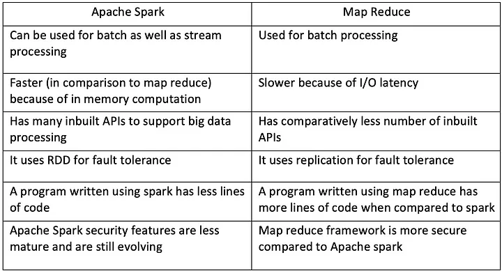
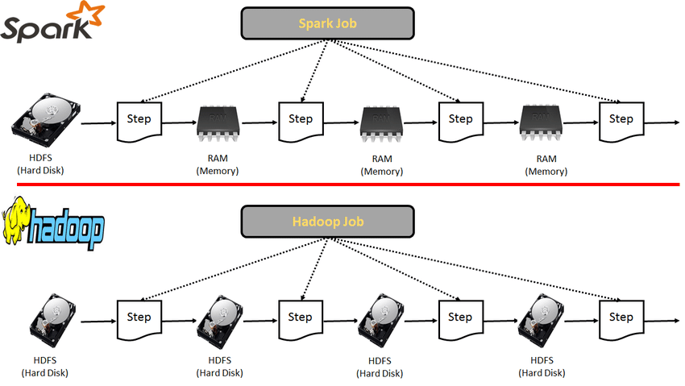
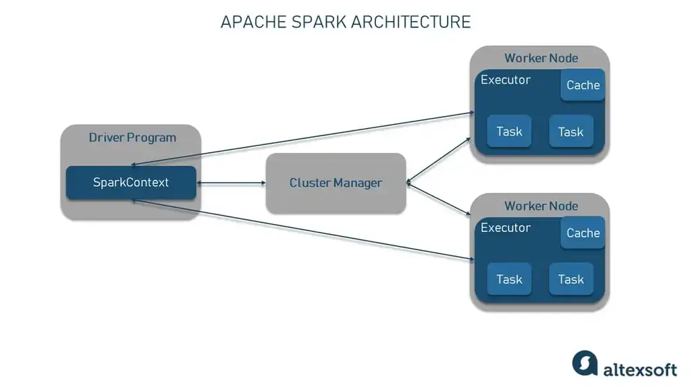
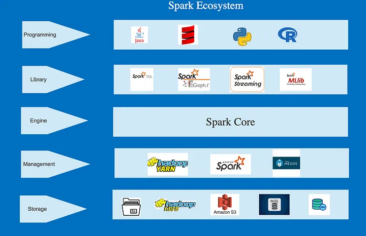

# Apache Spark


## Úvod

Apache Spark a MapReduce sú dva z najčastejšie používaných frameworkov na spracovanie big data.

## Rozdiely

MapReduce používa stratégiu split-apply-combine na analýzu dát, ktorá zahŕňa ukladanie rozdelených dát na disky clustera. Naproti tomu Spark používa in-memory vrstvu nad svojím úložiskom dát, čo umožňuje načítať a spracovať dáta paralelne v rámci clustera. Spark má výhodu v rýchlosti oproti MapReduce, pretože distribúcia a paralelné spracovanie dát sa vykonáva v pamäti.

### Funkcie

- **Speed** → Vďaka spracovaniu in-memory.
- **Caching** → Spark má caching vrstvu na cachovanie dát, čo robí spracovanie ešte rýchlejším.
- **Deployment** → Môže byť nasadený v Hadoop clusteri alebo vo vlastnom Spark clusteri.
- **Polyglot** → Kód môže byť napísaný v jazykoch Python, Java, Scala a R.
- **Real-time** → Bol vyvinutý na podporu real-time prípadov použitia.



### Rýchlosť a Výkon

Kľúčovou výhodou Apache Spark je jeho rýchlosť a výkon, najmä v porovnaní s Hadoop MapReduce — procesnou vrstvou big data frameworku Hadoop. Zatiaľ čo sa často uvádza, že Spark je "100-krát rýchlejší ako Hadoop", je dôležité pochopiť špecifiká tohto tvrdenia.

Táto štatistika pochádza z benchmarkového testu z roku 2014, kde Spark významne zlepšil výkon oproti Hadoop MapReduce. Schopnosť Sparku udržiavať dáta v pamäti (RAM) namiesto neustáleho zapisovania a čítania z disku zvyšuje jeho rýchlosť. Toto je obzvlášť výhodné pre iteratívne algoritmy, ako sú tie používané v machine learning a výpočtoch grafov, ktoré vyžadujú viacero prechodov cez tie isté dáta. V takýchto scenároch môže Spark významne prekonať Hadoop MapReduce.

Táto výhoda je však do istej miery podmienená. Rozdiel vo výkone nemusí byť taký výrazný pri jednoduchších operáciách, ktoré nevyžadujú viacero prechodov cez dáta.

## Architektúra

- **Hadoop (MapReduce)** → HDFS → Analýza → Uloženie → Načítanie z HDFS a Analýza → Uloženie → Načítanie z HDFS a Analýza → Výsledok HDFS.
- **Spark** → HDFS → RAM → Analýza → RAM → Analýza → RAM → Analýza → Výsledok HDFS.



### Master-Slave Architektúra v Apache Spark

Architektúra Apache Spark je založená na štruktúre master-slave, kde driver program (master node) pracuje s viacerými executors alebo worker nodes (slave nodes). Cluster pozostáva z jedného mastra a viacerých slave nodes, a Spark jobs sú distribuované v rámci tohto clustera.



#### Driver Program

**Driver Program** je "master" v master-slave architektúre, ktorý spúšťa hlavnú funkciu a vytvára `SparkContext`, slúžiaci ako vstupný bod ku všetkým funkcionalitám Spark. Komunikuje s Cluster Managerom na dohľad nad jobmi, rozdeľuje job na tasky a priraďuje tieto tasky worker nodes.

#### Cluster Manager

**Cluster Manager** je zodpovedný za alokáciu zdrojov v clusteri. Apache Spark je navrhnutý tak, aby bol kompatibilný s rôznymi možnosťami, vrátane Hadoop YARN, Mesos a vlastného standalone cluster managera.

#### Executors alebo Worker Nodes

**Executors** alebo **Worker Nodes** sú "slaves" zodpovední za dokončenie pridelených taskov. Spracovávajú tasky na rozdelených RDD a vracajú výsledok späť do `SparkContext`.

## Prípady Použitia

### Big Data Processing

In-memory computing a fault tolerance Apache Spark mu umožňujú rýchlo spracovávať veľké objemy dát, často v petabajtoch. Mnohé odvetvia ako telekomunikácie, financie a zdravotníctvo používajú Spark na ELT a ETL operácie.

### Analýza Dát

Spark SQL umožňuje hĺbkovú analýzu naprieč veľkými datasetmi uloženými v distribuovaných systémoch, poskytujúc insights pre business rozhodnutia. Napríklad, eCommerce spoločnosti používajú Spark SQL na analýzu clickstream dát a personalizáciu marketingových stratégií.

### Machine Learning

Spark MLlib knižnica poskytuje algoritmy machine learning, čo je užitočné pre prediktívnu analytiku ako predikcia customer churn a detekcia podvodov.

### Stream Processing

S nárastom IoT a potrebami real-time dát, Apache Spark streaming komponent spracováva dátové streamy v near real-time. Finančné inštitúcie používajú Spark Streaming na detekciu anomálií a sledovanie real-time obchodovania.

### Graph Processing

Spark GraphX knižnica umožňuje manipuláciu a výpočty grafov, čo je užitočné v analýze sociálnych sietí, PageRank algoritmoch a recommendation systémoch.

## Spark Ekosystém

Apache Spark je vysoko flexibilný a môže bežať na rôznych cluster manageroch, ako sú Hadoop YARN, Mesos, alebo standalone setup. Spark sa tiež integruje s dátovými zdrojmi ako HDFS, Cassandra, HBase a Amazon S3.

Navyše sa Spark pripája k populárnym knižniciam a frameworkom ako pandas, TensorFlow a PyTorch, umožňujúc komplexné výpočty a prediktívnu analytiku. Pre SQL a BI úlohy sa Spark prepája s nástrojmi ako Tableau, DBT a Looker pre sofistikovanú analytiku.

- **Engine** → Spark Core: Základný komponent Spark ekosystému, spravujúci úlohy ako scheduling, monitoring a základnú IO funkcionalitu.
- **Management** → Spark cluster môže byť spravovaný pomocou Hadoop YARN, Mesos, alebo Spark cluster managera.
- **Library** → Spark ekosystém zahŕňa Spark SQL, MLlib, GraphX a Spark Streaming.
- **Programming** → Spark podporuje Python, Java, Scala a R.
- **Storage** → Spark podporuje ukladanie dát v HDFS, S3 a SQL aj NoSQL databázach.



## Nevýhody Apache Spark

### Vysoká Spotreba Pamäte a Zvýšené Náklady na Hardware

Kvôli svojej závislosti na in-memory výpočtoch môže byť Spark náročný na zdroje, najmä čo sa týka pamäte. Tento dizajn vedie k vysokým prevádzkovým nákladom a limitom škálovateľnosti pre dátovo náročné aplikácie. Potreba väčších objemov RAM a rýchlejších CPU môže zvýšiť náklady na setup, najmä pre large-scale spracovanie dát.

### Limitovaná Podpora pre Real-time Processing

Napriek near real-time schopnostiam Spark neponúka true real-time processing. Spark Streaming sa spolieha na micro-batches, ktoré spracovávajú malé skupiny eventov zozbieraných počas preddefinovaných intervalov. Pre genuine streaming analytics môžu byť vhodnejšie nástroje ako Apache Flink alebo Apache Storm.

## Módy

- **Batch mode** → Job je naplánovaný a queue spúšťa batch jobov bez manuálnej intervencie.
- **Stream mode** → Program beží a spracováva dátové streamy ako prichádzajú.
- **Interactive mode** → Používateľ vykonáva príkazy v shelli, hlavne používané pre vývojové účely.

## Zhrnutie

Pokryli sme Apache Spark, jeho ekosystém, architektúru a funkcie, a ako sa líši od MapReduce. Popularita Spark je daná jeho in-memory processing schopnosťami, ktoré poskytujú rýchle výsledky, a jeho schopnosťou zvládať real-time prípady použitia. RDD sú základom funkcií Spark. Pre viac informácií navštívte [oficiálnu dokumentáciu](https://spark.apache.org/documentation.html).

## Zdroje

- [Introduction to Apache Spark - Expedia Group Tech](https://medium.com/expedia-group-tech/an-introduction-to-apache-spark-f0795f2d5201)
- [Apache Spark: Pros and Cons - AltexSoft](https://www.altexsoft.com/blog/apache-spark-pros-cons/)
- [Introduction to Apache Spark - YouTube](https://www.youtube.com/watch?v=myVWLaUdJac)

## Inštalácia a Rýchly Štart

Pre inštaláciu PySpark s Python:

```bash
pip install pyspark
# Load CSV file into DataFrame
df = spark.read.csv("accounts.csv", header=True)

# Select subset of features and filter for balance > 0
filtered_df = df.select("AccountBalance", "CountOfDependents").filter("AccountBalance > 0")

# Generate summary statistics
filtered_df.summary().show()
```
