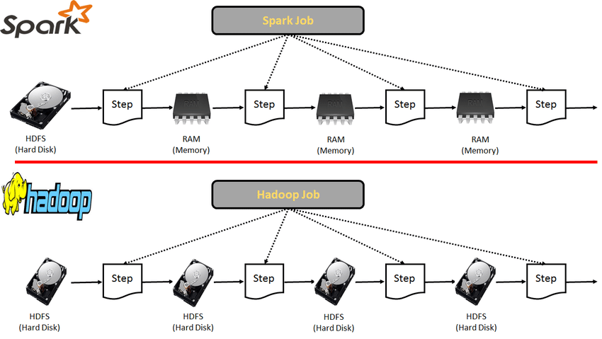

# Apache Spark


## Introduction

Apache Spark and MapReduce are two of the most common big data processing frameworks.

## Differences

MapReduce uses a split-apply-combine strategy for data analysis, which involves storing the split data on the disks of a cluster. In contrast, Spark uses an in-memory layer on top of its data store, allowing data to be loaded and processed in parallel across the cluster. Spark has a speed advantage over MapReduce because the distribution and parallel processing of data are done in-memory.

### Features

- **Speed** → Due to in-memory processing.
- **Caching** → Spark has a caching layer to cache the data, making the processing even faster.
- **Deployment** → Can be deployed in a Hadoop cluster or its own Spark cluster.
- **Polyglot** → Code can be written in Python, Java, Scala, and R.
- **Real-time** → It was developed to support real-time use cases.


### Speed and Performance

A key advantage of Apache Spark is its speed and performance, especially compared to Hadoop MapReduce — the processing layer of the Hadoop big data framework. While Spark's speed is often cited as being "100 times faster than Hadoop," it's crucial to understand the specifics of this claim.

This statistic comes from a 2014 benchmark test where Spark significantly improved performance over Hadoop MapReduce. Spark’s ability to hold data in memory (RAM) rather than continually writing and reading to and from a disk enhances its speed. This is particularly beneficial for iterative algorithms, such as those used in machine learning and graph computation, which require multiple passes over the same data. In scenarios like these, Spark can significantly outperform Hadoop MapReduce.

However, this advantage is somewhat conditional. The performance difference may not be as pronounced in simpler operations that don't require multiple passes over the data.

## Architecture

- **Hadoop (MapReduce)** → HDFS → Analyze → Store → Load From HDFS and Analyze → Store → Load From HDFS and Analyze → Result HDFS.
- **Spark** → HDFS → RAM → Analyze → RAM → Analyze → RAM → Analyze → Result HDFS.



### Master-Slave Architecture in Apache Spark

Apache Spark's architecture is based on a master-slave structure where a driver program (the master node) operates with multiple executors or worker nodes (the slave nodes). The cluster consists of a single master and multiple slaves, and Spark jobs are distributed across this cluster.


#### Driver Program

The **Driver Program** is the "master" in the master-slave architecture that runs the main function and creates a `SparkContext`, acting as the entry point to all Spark functionalities. It communicates with the Cluster Manager to supervise jobs, partitions the job into tasks, and assigns these tasks to worker nodes.

#### Cluster Manager

The **Cluster Manager** is responsible for allocating resources in the cluster. Apache Spark is designed to be compatible with a range of options, including Hadoop YARN, Mesos, and its own standalone cluster manager.

#### Executors or Worker Nodes

**Executors** or **Worker Nodes** are the "slaves" responsible for completing the assigned tasks. They process tasks on the partitioned RDDs and return the result back to the `SparkContext`.

## Use Cases

### Big Data Processing

Apache Spark's in-memory computing and fault tolerance enable it to process large volumes of data quickly, often in petabytes. Many industries, such as telecommunications, finance, and healthcare, use Spark for ELT and ETL operations.

### Data Analysis

Spark SQL enables in-depth analysis across large datasets stored in distributed systems, providing insights for business decisions. For example, eCommerce companies use Spark SQL to analyze clickstream data and personalize marketing strategies.

### Machine Learning

Spark's MLlib library provides machine learning algorithms, making it useful for predictive analytics such as customer churn prediction and fraud detection.

### Stream Processing

With the rise of IoT and real-time data needs, Apache Spark's streaming component processes data streams in near real-time. Financial institutions use Spark Streaming to detect anomalies and track real-time trading.

### Graph Processing

Spark's GraphX library allows for graph manipulation and computation, which is useful in social network analysis, PageRank algorithms, and recommendation systems.

## Spark Ecosystem

Apache Spark is highly flexible and can be run on various cluster managers, such as Hadoop YARN, Mesos, or a standalone setup. Spark also integrates with data sources like HDFS, Cassandra, HBase, and Amazon S3.

Additionally, Spark connects to popular libraries and frameworks like pandas, TensorFlow, and PyTorch, enabling complex computations and predictive analytics. For SQL and BI tasks, Spark interfaces with tools like Tableau, DBT, and Looker for sophisticated analytics.

- **Engine** → Spark Core: The basic component of the Spark ecosystem, handling tasks like scheduling, monitoring, and basic IO functionality.
- **Management** → Spark cluster can be managed by Hadoop YARN, Mesos, or the Spark cluster manager.
- **Library** → The Spark ecosystem includes Spark SQL, MLlib, GraphX, and Spark Streaming.
- **Programming** → Spark supports Python, Java, Scala, and R.
- **Storage** → Spark supports data storage in HDFS, S3, and both SQL and NoSQL databases.


## Apache Spark Disadvantages

### High Memory Consumption and Increased Hardware Costs

Due to its reliance on in-memory computations, Spark can be resource-intensive, particularly regarding memory. This design results in high operational costs and scalability limits for data-intensive applications. The need for larger volumes of RAM and faster CPUs can increase setup costs, especially for large-scale data processing tasks.

### Limited Support for Real-time Processing

Despite Spark's near real-time capabilities, it doesn't offer true real-time processing. Spark Streaming relies on micro-batches, which handle small groups of events collected over predefined intervals. For genuine streaming analytics, tools like Apache Flink or Apache Storm may be better suited.

## Modes

- **Batch mode** → A job is scheduled, and a queue runs the batch of jobs without manual intervention.
- **Stream mode** → The program runs and processes data streams as they come in.
- **Interactive mode** → The user executes commands on a shell, mainly used for development purposes.

## Summary

We have covered Apache Spark, its ecosystem, architecture, and features, and how it differs from MapReduce. Spark's popularity is due to its in-memory processing capabilities, which deliver speedy results, and its ability to handle real-time use cases. RDDs are the backbone of Spark's features. For more information, check the [official documentation](https://spark.apache.org/documentation.html).

## Sources

- [Introduction to Apache Spark - Expedia Group Tech](https://medium.com/expedia-group-tech/an-introduction-to-apache-spark-f0795f2d5201)
- [Apache Spark: Pros and Cons - AltexSoft](https://www.altexsoft.com/blog/apache-spark-pros-cons/)
- [Introduction to Apache Spark - YouTube](https://www.youtube.com/watch?v=myVWLaUdJac)

## Installation and Quick Start

To install PySpark with Python:

```bash
pip install pyspark
# Load CSV file into DataFrame
df = spark.read.csv("accounts.csv", header=True)

# Select subset of features and filter for balance > 0
filtered_df = df.select("AccountBalance", "CountOfDependents").filter("AccountBalance > 0")

# Generate summary statistics
filtered_df.summary().show()
```
